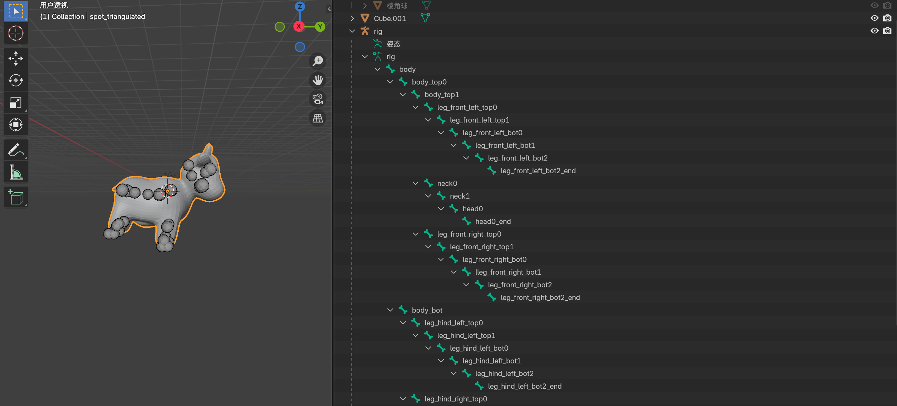
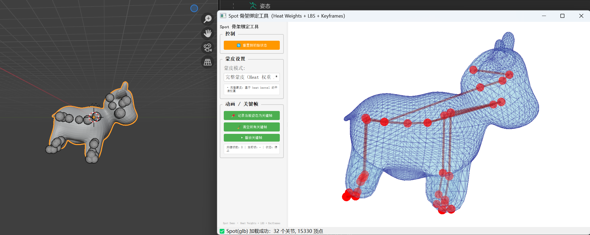
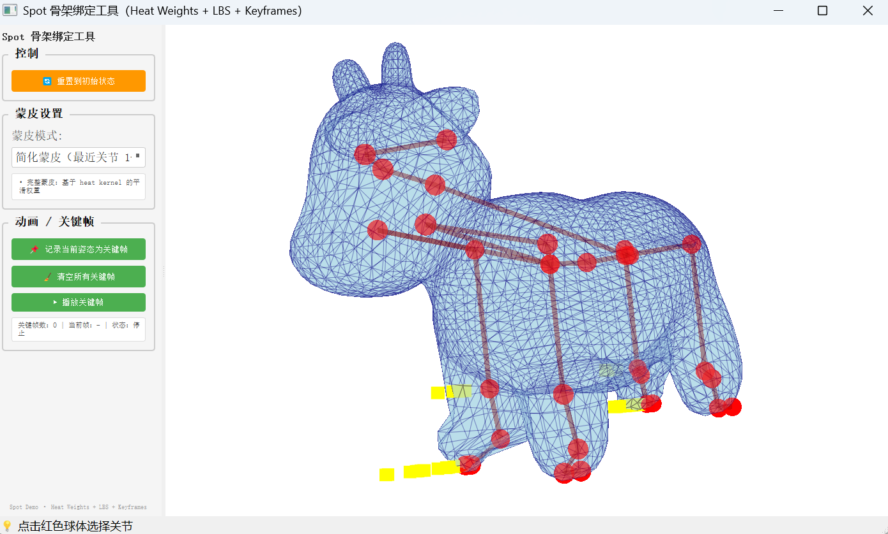
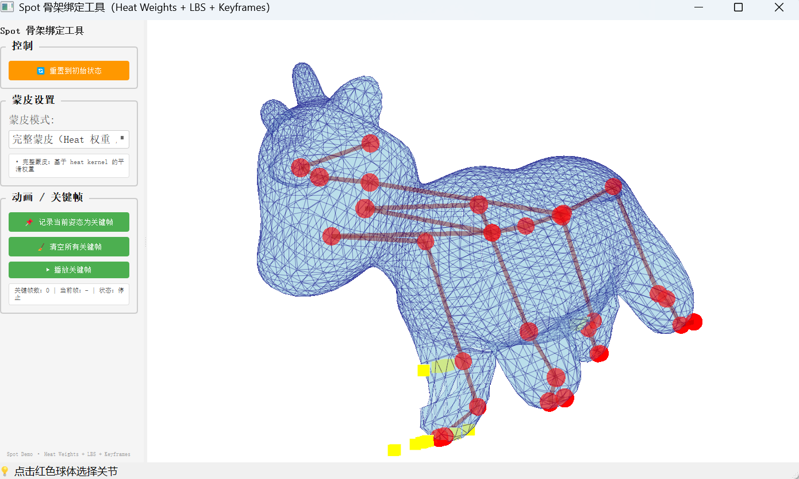

# 项目中期文档

> 张泽宇 2022012117 zhangzey22@mails.tsinghua.edu.cn
> 中期文档中的图片不代表最终效果
> 代码仓库：https://github.com/Alchuang22-dev/MiniSkeleton.git

## 1. 骨架关节点的创建思路

### 1.1 目标与约束

在本项目需要实现的系统里，**骨架**（skeleton）是驱动网格形变的抽象控制结构，设计时要同时满足以下要素：

- 拓扑上，能覆盖角色主要的运动 DOF：躯干、四肢、头颈等；

- 几何上，关节点位置要与网格形状匹配：大致位于体积中心线或关节转折处；

- 数值上，骨骼深度和父子层级要适合后续的 FK、Heat Weights 与 LBS 计算。

### 1.2 骨架结构设计

中期阶段项目主要分析的模型是`spot`，对于这类模型，项目暂时实现了通用的四足动物骨骼范式：

|部位|对应骨骼|作用|
|---|---|---|
|躯干主干链（root/body）|`body_top0 -> body_top1 -> ...`|对应动物背部的中心线；核心作用是整体位移、弯曲和躯干扭转。|
|颈部 + 头部链（neck/head）|从躯干上部某个关节出发：`neck0 -> neck1 -> head0 -> head0_end`|用于控制抬头、点头、左右转头；末端点可作为看向目标的 IK 终端。|
|前腿链（left/right front leg）|每条腿一般 3–4 段：`leg_front_left_top0 -> leg_front_left_top1 -> leg_front_left_bot0 -> ...`|从躯干下部沿法线方向向下，经过肩、肘、腕等动作位置。|
|后腿链（left/right hind leg）|类似前腿：`leg_hind_left_top0 -> ... -> leg_hind_left_bot2_end`|摆放位置略偏后；用于控制跳跃、行走、蹲伏等动作。
|
|尾巴 / 耳朵等附属链||用单独的分支关节链表示，后续用于增加动画张力以及用于多模型交互，但不影响主躯干权重分布。|

在具体实现上，本项目进行了两层抽象：

- 数据层：

    -  使用 `Skeleton / Joint` 类描述：

    - `Joint.name`：唯一标识

    - `Joint.parent`：父节点 index

    - `Joint.bind_local`：在 Bind Pose 下的局部变换矩阵（相对父节点）

    -  支持从 GLB/FBX 的 skins + inverseBindMatrices 中自动构建。

- 计算层：

    - 骨架类提供 Forward Kinematics：

    - 输入每个关节的局部姿态（旋转/平移），输出 global_mats（世界变换）；

    - 用于 LBS、Gizmo 显示和 UI 交互。

### 与 GLB 骨架的对应关系

1. 当前 pipeline 中，`Spot` 模型的骨架是在 **DCC 工具**（Blender）中手动完成，以 GLB 形式导出。

2. 得到 GLB 文件后，项目在 `gltf_loader.py` 中实现了骨骼加载器，功能包括：读取 mesh（顶点/面）；读取 `skin.joints` 列表，按 parent 关系恢复关节树；使用 inverseBindMatrices 反推 Bind Pose 下的 `global_mats`；并由 `global_mats` 和 parent 关系推回 `bind_local`，构造 `Skeleton` 实例。

3. 在经过以上步骤后，基本可以保证  骨架结构与 Blender 中完全一致，如果重新在 DCC 里调整骨架，只要重新导出 GLB 即可复用。

## 2. 模型表面点权重的算法设计

### 2.1 最近骨骼 / 双骨插值（weights_nearest.py）

这是一个基础、快速的权重初始化方法，在项目中用作测试，以及 Heat 权重的 warm start 或 fallback。该算法的核心思路如下：

1. **距离度量**：

   - 把每根骨骼看作线段（父关节 (p)、子关节 (c)）；
   - 对每个顶点 (v)，计算到若干骨骼线段的**最短距离** (d_k)；
   - 只保留距离最近的前 (K) 根骨骼（比如 2–4 根）。

2. **权重分配**：

   - 将距离反比转为权重：
     $$[\tilde{w}_k = \frac{1}{d_k^\alpha + \epsilon},\quad w_k = \frac{\tilde{w}_k}{\sum_j \tilde{w}_j}]$$
   - 通常取$(\alpha \in [1,2])$，调整衰减速度。
3. **拓扑一致性优化（双线性/双骨插值）**：

   - 对于位于肢体中部的顶点 (v)，会同时靠近父骨和子骨；
   - 可以基于顶点在骨骼方向上的投影参数 ($t\in[0,1]$) 做线性插值，调节父子骨权重比例；
   - 这样关节弯曲时形变更自然。

算法优点：

- 依赖少量几何操作（点到线段距离），实现简单；
- 适合作为初始权重或监控权重场是否“跑偏”。

缺点：

- 对骨骼密度和布置较敏感；
- 在复杂拓扑处容易出现权重不连续。

### 2.2 Heat Diffusion 权重（weights_heat.py）

这是主要的“生产级”权重算法，参考 Pinocchio 等工作中的**基于热传导的骨骼权重**思想。核心思想：

> 把每个骨骼关节当作“热源”，在三角形网格上做热扩散，最终稳态温度场即为该关节的权重分布。

#### 2.2.1 离散拉普拉斯与热方程

在网格上，项目构造了**离散拉普拉斯矩阵** ($L \in \mathbb{R}^{n\times n}$)（(n) 为顶点数），例如使用 cotangent 权重：

$$[
(Lu)*i = \sum*{j \in N(i)} w_{ij}(u_i - u_j)
]$$

对每个关节 (j)，希望求出权重函数 ($w^{(j)}\in\mathbb{R}^n$)，满足离散热方程稳态形式：

$$[
(L + \tau I), w^{(j)} = b^{(j)}
]$$

其中：

- ($\tau > 0$) 为热扩散系数（控制平滑程度）；
- ($b^{(j)}$) 是“热源项”：在靠近关节的若干顶点上赋 1，其余为 0。

**直观理解**：

- (L) 惩罚空间梯度（鼓励平滑）；
- ($\tau I$) 把权重“拉回”热源；
- 解 ($w^{(j)}$) 相当于**在网格上做一次带衰减的散热**。

#### 2.2.2 线性系统与数值求解

对每个关节 (j) 解一个稀疏线性系统：

$$[
(L + \tau I), w^{(j)} = b^{(j)}
]$$

数值实现上：

- 预先用 `scipy.sparse` 构建好 (A = L + \tau I)；
- 对各关节频繁调用 `cg(A, b_j, ...)`（共轭梯度法）；
- 为了避免共轭梯度不收敛，通常会：

  - 选取适度的 (\tau)；
  - 对 `cg` 设置合理的 `maxiter` 和残差阈值；
  - 失败时 fallback 到最近骨骼权重。

最终把所有关节的结果堆叠，得到权重矩阵 ($W \in \mathbb{R}^{n \times J}$)，再对每个顶点的权重 `W[i]` 做归一化：

$$[
W_{ij} \leftarrow \frac{\max(W_{ij}, 0)}{\sum_k \max(W_{ik}, 0) + \varepsilon}
]$$

#### 2.2.3 与 LBS 的结合

一旦有了 (W) 和 FK 算出的关节矩阵 (T_j)，就可以进行标准的**线性混合蒙皮**：

$$[
v_i' = \sum_j W_{ij} ; (T_j , T_j^{\text{bind}^{-1}}) ; \hat{v}_i
]$$

其中：

- ($\hat{v}_i$) 为 Bind Pose 下的齐次坐标；
- ($T_j^{\text{bind}}$) 由 GLB 的 `inverseBindMatrices` 或 Skeleton 的绑定位姿推得。

Heat 权重的好处：

- 权重场在模型表面**连续且平滑**；
- 在关节附近自然实现多骨“混合”控制，弯曲时不易产生明显折痕；
- 对骨架布置有一定鲁棒性，不要求手动刷权。

### 2.3 蒙皮效果展示

尝试给 `Spot` 模型添加一个“向前走路”的动作：

- 最近骨骼权重：

- Heat权重：

## 3. 参考文献列表

|名称|文献链接|
|---|---|
|Ilya Baran and Jovan Popović. 2007. Automatic rigging and animation of 3D characters. ACM Trans. Graph. 26, 3 (July 2007), 72–es.|https://www.cs.toronto.edu/~jacobson/seminar/baran-and-popovic-2007.pdf|
|Automatic Skinning using the Mixed Finite Element Method (Arxiv)|https://arxiv.org/html/2408.04066v1|

